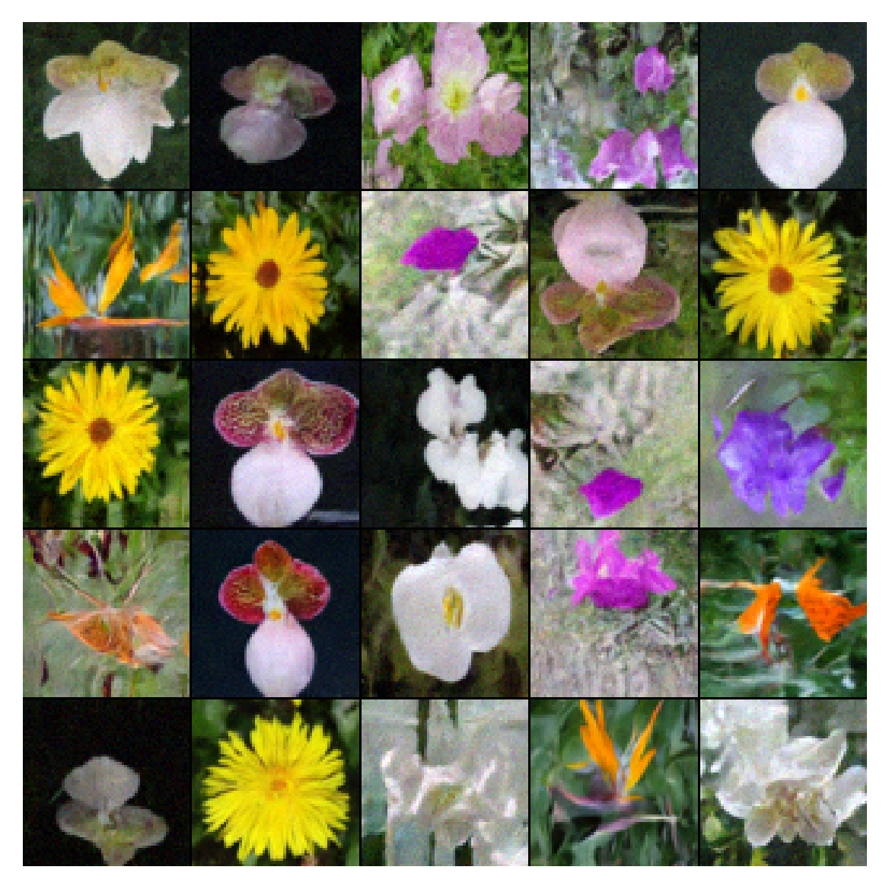

<h1 align='center'>sgm</h1>
<h2 align='center'>Score-based Diffusion models in JAX</h2>

Implementation and extension of [Score-Based Generative Modeling through Stochastic Differential Equations (Song++20)](https://arxiv.org/abs/2011.13456) and [Maximum Likelihood Training of Score-Based Diffusion Models (Song++21)](https://arxiv.org/abs/2101.09258) in `jax` and `equinox`. 

> :building_construction: Note this repository is under construction, expect changes. :building_construction:

### Score-based diffusion models

For any SDE of the form 

$$
\text{d}\boldsymbol{x} = f(\boldsymbol{x}, t)\text{d}t + g(t)\text{d}\boldsymbol{w}
$$

there exists an associated ordinary differential equation (ODE)

$$
\text{d}\boldsymbol{x} = [f(\boldsymbol{x}, t)\text{d}t - \frac{1}{2}g(t)^2\nabla_{\boldsymbol{x}}\log p_t(\boldsymbol{x})]\text{d}t
$$

where the trajectories of the SDE and ODE have the same marginal PDFs $p_t(\boldsymbol{x})$.

### Computing log-likelihoods with diffusion models

For each SDE there exists a deterministic ODE with marginal likelihoods $p_t(\boldsymbol{x})$ that match the SDE for all time $t$

$$
\text{d}\boldsymbol{x} = [f(\boldsymbol{x}, t)\text{d}t - \frac{1}{2}g(t)^2\nabla_{\boldsymbol{x}}\log p_t(\boldsymbol{x})]\text{d}t != F(\boldsymbol{x}(t), t)
$$

The continuous normalizing flow formalism allows the ODE to be expressed as

$$
\frac{\partial}{\partial t} \log p(\boldsymbol{x}(t)) = -\text{Tr}\bigg [ \frac{\partial}{\partial \boldsymbol{x}(t)} F(\boldsymbol{x}(t), t) \bigg ]
$$

but note that maximum-likelihood training is prohibitively expensive for SDE based diffusion models.

### Usage
Install via
```
pip install -e .
```
to run
```
python main.py
```

### Features

* Parallelised exact and approximate log-likelihood calculations,
* UNet and transformer score network implementations,
* VP, SubVP and VE SDEs (neural network $\beta(t)$ and $\sigma(t)$ functions are on the list!),
* Multi-modal conditioning (basically just optional parameter and image conditioning methods),
* Multi-device training and sampling.

### Samples

> Note: I haven't optimised any training/architecture hyperparameters or trained long enough here, you could do a lot better. 

<h4 align='left'>Flowers</h4>

Euler-Marayama sampling


ODE sampling


<h4 align='left'>CIFAR10</h4>

Euler-Marayama sampling


ODE sampling


<!--  -->

### SDEs 


<!-- <p align="center">
  
</p> -->